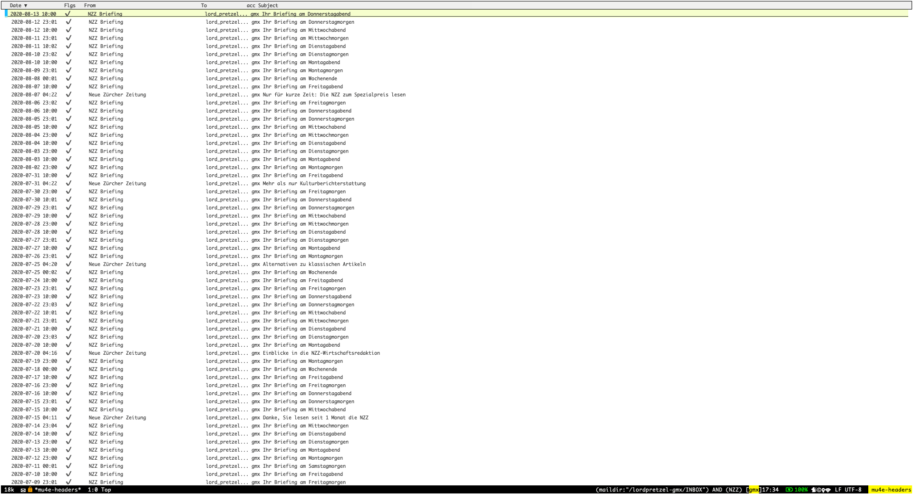

 <!--  --> <!--  -->  

# mu4e-views

 [mu4e](https://www.djcbsoftware.nl/code/mu/mu4e.html) is great, but viewing of html emails is suboptimal.  This packages enables the user to choose how to view emails.  It's main use case is to view html emails using an xwidgets window, but custom viewing methods are also supported.

Also provides methods to access content extracted from an email, e.g., urls or attachments. This makes it easier to build user defined viewing methods.

## Installation

### MELPA

`mu4e-views` is available from MELPA (both
[stable](http://stable.melpa.org/#/mu4e-views) and
[unstable](http://melpa.org/#/mu4e-views)).  Assuming your
`package-archives` lists MELPA, just type

~~~sh
M-x package-install RET mu4e-views RET
~~~

to install it.

### Prerequisites

If you are not installing from [melpa](http://melpa.org/#/mu4e-views) you have to install the dependency [xwidgets-reuse](https://github.com/lordpretzel/xwidgets-reuse) first. Also this uses `xwidget`, so you can only use this package if your emacs has been compiled with support for `xwidget`. If you are unsure whether this is the case try running: `(xwidget-webkit-browse-url "https://www.gnu.org/")`.

### Quelpa

Using [use-package](https://github.com/jwiegley/use-package) with [quelpa](https://github.com/quelpa/quelpa).

~~~elisp
(use-package
  :quelpa ((mu4e-views
    :fetcher github
    :repo "lordpretzel/mu4e-views")
  :upgrade t))
~~~

### straight

Using [use-package](https://github.com/jwiegley/use-package) with [straight.el](https://github.com/raxod502/straight.el)

~~~elisp
(use-package mu4e-views
  :straight (mu4e-views :type git :host github :repo "lordpretzel/mu4e-views"))
~~~

### Source

Alternatively, install from source. First, clone the source code:

~~~sh
cd MY-PATH
git clone https://github.com/lordpretzel/mu4e-views.git
~~~

Now, from Emacs execute:

~~~
M-x package-install-file RET MY-PATH/mu4e-views
~~~

Alternatively to the second step, add this to your Symbol’s value as variable is void: \.emacs file:

~~~elisp
(add-to-list 'load-path "MY-PATH/mu4e-views")
(require 'mu4e-views)
~~~

## Usage

This package changes the way how `mu4e` shows emails when selecting an email from the `mu4e-headers` view. The main purpose of this package is to enable viewing of `html` emails in `xwidgets-webkit`, but is also possible for a user to define new custom views. Once a view is selected, you just use `mu4e` as usual and emails selected in the `headers` view are shown using the currently active view method.

### Setup

After the package is loaded, you can call `mu4e-views-mu4e-select-view-msg-method` from the `mu4e-headers` view to select the method to use for viewing. Per default `mu4e-view` supports:

- `html` - uses `xwidgets` to show the email
- `text` - the default `mu4e` method for viewing emails that translates the email into text
- `browser` - open the email using `browse-url`, e.g., in your system browser
- `gnu` - open the meail using `mu4e`'s gnus method

You may want to bind this to a key in `mu4e-headers-mode-map`.

~~~elisp
(define-key mu4e-headers-mode-map (kbd "v") #'mu4e-views-mu4e-select-view-msg-method)
~~~

Here is an example setup:

~~~elisp
(use-package mu4e-views
  :after mu4e
  :defer nil
  :bind (:map mu4e-headers-mode-map
	    ("v" . mu4e-views-mu4e-select-view-msg-method) ;; select viewing method
	    ("M-n" . mu4e-views-cursor-msg-view-window-down) ;; from headers window scroll the email view
	    ("M-p" . mu4e-views-cursor-msg-view-window-up) ;; from headers window scroll the email view
        ("f" . mu4e-views-toggle-auto-view-selected-message) ;; toggle opening messages automatically when moving in the headers view
	    )
  :config
  (setq mu4e-views-completion-method 'ivy) ;; use ivy for completion
  (setq mu4e-views-default-view-method "html") ;; make xwidgets default
  (mu4e-views-mu4e-use-view-msg-method "html") ;; select the default
  (setq mu4e-views-next-previous-message-behaviour 'stick-to-current-window) ;; when pressing n and p stay in the current window
  (setq mu4e-views-auto-view-selected-message t)) ;; automatically open messages when moving in the headers view
~~~

### Settings

- `mu4e-views-completion-method` - framework used for completion.
- `mu4e-views-inject-email-information-into-html` - if `t`, then create a header shown on top of the html message with useful information from the email. The header uses CSS styles defined in `mu4e-views-mu4e-html-email-header-style`.
- `mu4e-views-mu4e-html-email-header-style` - CSS style for showing the header of an email (`mu4e-views` injects this header into the html text of the email). Customize to change appearance of this header.
- `mu4e-views-mu4e-email-headers-as-html-function` - if you want to change what html is injected for an email more radically, then you can supply your own function for doing this. This function should take a single parameter that is a `mu4e` message `plist`. Have a look at the `mu4e` source code to learn more about what information is stored in such a plist.
- `mu4e-views-next-previous-message-behaviour` - per default `mu4e` switches from the `headers` window to the `view` window once an email is opened, e.g., by pressing `n`. This option customizes this behavior:
  - `always-switch-to-headers` - always switch back the `headers` window
  - `always-switch-to-view` - always switch back the `view` window (default behavior of `mu4e`)
  - `stick-to-current-window` - stay in the current window (`headers` or `views`)
- `mu4e-views-view-commands` - the view methods supported by `mu4e-views`. Customize to add new methods.
- `mu4e-views-default-view-method` - the default method for viewing emails.
- `mu4e-views-auto-view-selected-message` - if `t` (default), then automatically show the email selected in the headers view if the view window is shown. That means when moving between emails with `n` and `p` the view window is updated to show the selected email.

### xwidgets view

Several keys are bound in this view to store attachments, open attachments, go to urls in the email similar to the regular `mu4e` view window.

- `q`: `mu4e-views-mu4e-headers-windows-only` - quit view window
- `n`: `mu4e-views-mu4e-headers-next` - move to next message
- `p`: `mu4e-views-mu4e-headers-prev` - move to previous message
- `o`: `mu4e-views-mu4e-view-open-attachment` - open an attachment
- `g`: `mu4e-views-mu4e-view-go-to-url` - go to URL from email
- `k`: `mu4e-views-mu4e-view-save-url` - save URL
- `e`: `mu4e-views-mu4e-view-save-attachment` - save an attachment
- `E`: `mu4e-views-mu4e-view-save-all-attachment` - save all attachments
- `a`: `mu4e-views-mu4e-view-action` - call a `mu4e` view action
- `f`: `mu4e-views-mu4e-view-fetch-url` - fetch URL from email
- `y`: `mu4e-views-select-other-view` - switch to the other view (the headers view)

#### Synergy with `xwwp`

To use your keyboard to click on links in an email shown in `xwidgets`, you can use the excellent [xwwp](https://github.com/canatella/xwwp) package.

### Define custom views

To define a new view, you need to write a function `my-view-func(html msg win)` that uses window `win` to show the message. `html` is the name of a file storing `html` text of the message.
If `mu4e-views-inject-email-information-into-html` is `t` then `mu4e-views` injects a header into the html code to show some basic information about the email (e.g., sender, attachments, ...). `msg` is a `mu4e` internal message plist. You can use it to extract additional information about the email to be shown. Please refer to the  [mu4e](https://www.djcbsoftware.nl/code/mu/mu4e.html) and `mu4e-views` source code to see how this works.

To make `mu4e-views` aware of your new view method add it to `mu4e-views-view-commands` giving it a user-facing name. The format is `(cons name plist)`. Methods that do not show the email in emacs should set `:no-view-window t` which instructs `mu4e-views` to not create a window for viewing the email. For example, the browser method does this. Furthermore, if your method does not need `m4ue-views` to generate the message as an html file then use `:view-function-only-msg t`. In this case your function should have the signature `(msg win)`. Any view methods needs to set `:viewfunc`. Views that use windows (`:no-view-window` is not set) need to provide a function `:is-view-window-p` with signature `(window)` that returns `t` if `window` is the window your method uses for showing the email. Optionally, you can also set `:create-view-window` if the window you use for showing messages needs some initial setup before the asynchronous `mu4e` method for viewing an email is called (whose callback will indirectly call your `:viewfunc`). For example, the method below shows the raw html code of messages.

~~~elisp
(defun mu4e-views-view-raw-html (html msg win)
  (let ((buf (find-file-noselect html)))
    (with-current-buffer buf
      (read-only-mode)
      (select-window win)
      (switch-to-buffer buf t t))))

(defun mu4e-views-view-raw-html-is-view-p (win)
  (let ((winbuf (window-buffer win)))
    (with-current-buffer winbuf
      (eq major-mode 'html-mode))))

(add-to-list 'mu4e-views-view-commands
             '("rawhtml" .
               (:viewfunc mu4e-views-view-raw-html
                          :is-view-window-p mu4e-views-view-raw-html-is-view-p)))
~~~

`mu4e-views` provides several helper functions for typical operations with emails such as storing attachments as described above. These functions can be used in custom views too.
